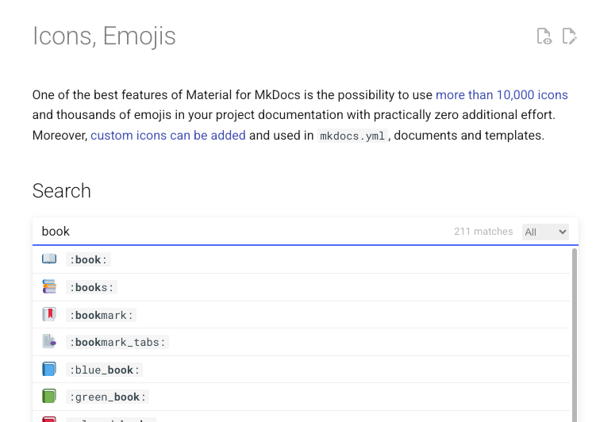

# Advanced

## Icons & Emojis
> [https://squidfunk.github.io/mkdocs-material/reference/icons-emojis/](https://squidfunk.github.io/mkdocs-material/reference/icons-emojis/)

官方文件可以搜尋 icons emojis 清單



## YAML Front Matter
隱藏這頁的目錄
```yaml
---
hide:
  - toc
---
```

## Tab
```markdown
<div id="centered-install-tabs" class="install-command-container" markdown="1">

=== "Python"
    Tab 1 content

=== "Java"
    Tab 2 content
</div>
```
<div id="centered-install-tabs" class="install-command-container" markdown="1">

=== "Python"
Tab 1 content

=== "Java"
Tab 2 content
</div>

## Admonitions 警告
> [https://squidfunk.github.io/mkdocs-material/reference/admonitions/](https://squidfunk.github.io/mkdocs-material/reference/admonitions/)

寫法
<div id="centered-install-tabs" class="install-command-container" markdown="1">

=== "一般"
    ```markdown
    !!! note "標題"
    
        內容...
    ```
    
    !!! note "標題"
    
        內容...

=== "無標題"
    ```markdown
    !!! note ""
    
        無標題，直接顯示內文
    ```
    
    !!! note ""
    
        無標題，直接顯示內文

=== "折疊 (預設收折)"
    ```markdown
    ??? note "可折疊，預設收折"
    
        內容...
    ```
    
    ??? note "可折疊，預設收折"
    
        內容...

=== "折疊 (預設展開)"
    ```markdown
    ???+ note "可折疊，預設展開"
    
        內容...
    ```
    
    ???+ note "可折疊，預設展開"
    
        內容...


</div>

支援圖標:
- note
- abstract
- info
- tip
- success
- question
- warning
- failure
- danger
- bug
- example
- quote
